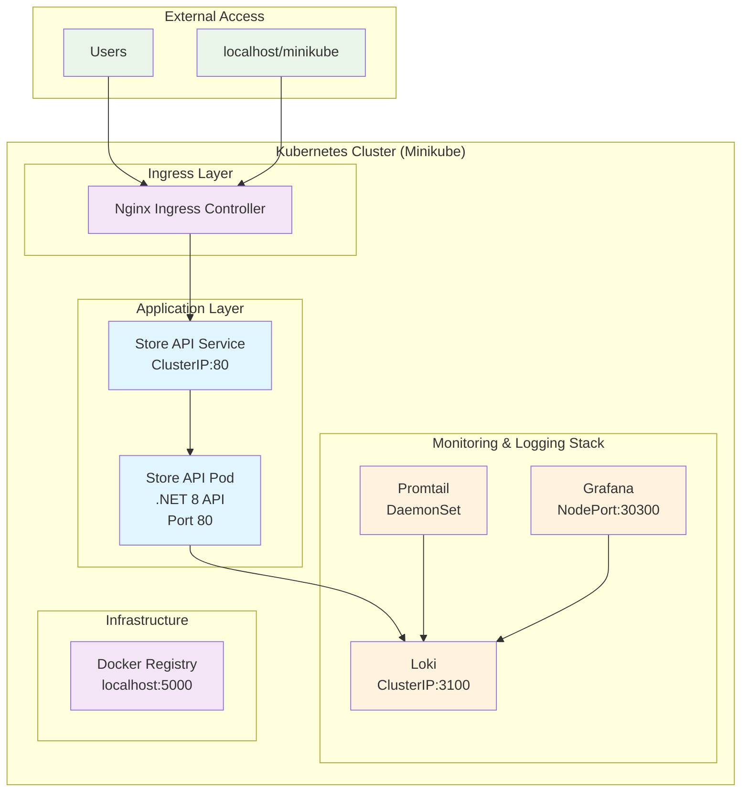
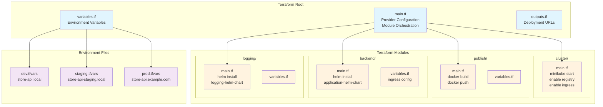
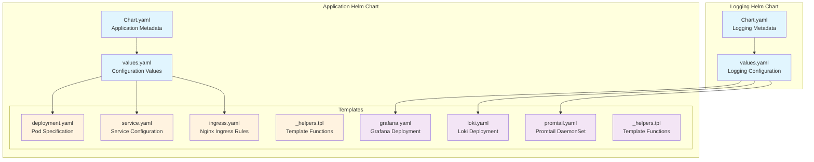

# DevOps Challenge - Infrastructure Architecture

## Overview

This document describes the infrastructure architecture and CI/CD pipeline for the DevOps Challenge application. The solution demonstrates a complete containerized microservices deployment with monitoring, logging, and automated infrastructure provisioning.

## Application Architecture



## Infrastructure Components

### Core Application
- **Store API**: .NET 8 REST API with CRUD operations
- **Docker Registry**: Local registry for container images
- **Kubernetes Service**: ClusterIP service exposing the API internally
- **Nginx Ingress**: External access via `store-api.local` (configurable per environment)

### Monitoring & Logging
- **Grafana**: Visualization and dashboards (accessible via NodePort 30300)
- **Loki**: Log aggregation and storage
- **Promtail**: Log collection from all pods

### Container Orchestration
- **Minikube**: Local Kubernetes cluster
- **Helm Charts**: Package management for Kubernetes deployments
- **Docker**: Container runtime and image building

## CI/CD Pipeline

```mermaid
graph TD
    subgraph "Source Control"
        GH[GitHub Repository<br/>andonyns/devops-challenge]
    end
    
    subgraph "CI/CD Pipeline (Jenkins)"
        CO[Checkout Code]
        SEC[Security Scan<br/>Checkov]
        TI[Terraform Init]
        TP[Terraform Plan]
        TA[Terraform Apply<br/>(Manual Approval)]
        
        CO --> SEC
        SEC --> TI
        TI --> TP
        TP --> TA
    end
    
    subgraph "Build & Deploy Process"
        subgraph "Terraform Modules"
            CM[Cluster Module<br/>Start Minikube<br/>Enable Addons]
            PM[Publish Module<br/>Build & Push Images]
            BM[Backend Module<br/>Deploy Helm Chart]
            LM[Logging Module<br/>Deploy Monitoring]
        end
        
        CM --> PM
        PM --> BM
        CM --> LM
    end
    
    subgraph "Target Environment"
        MK[Minikube Cluster]
        DR[Docker Registry]
        K8S[Kubernetes Resources]
        MON[Monitoring Stack]
    end
    
    GH --> CO
    TA --> CM
    PM --> DR
    BM --> K8S
    LM --> MON
    
    classDef source fill:#e8f5e8
    classDef cicd fill:#fff3e0
    classDef deploy fill:#e1f5fe
    classDef target fill:#f3e5f5
    
    class GH source
    class CO,SEC,TI,TP,TA cicd
    class CM,PM,BM,LM deploy
    class MK,DR,K8S,MON target
```

## Terraform Module Architecture



## Helm Chart Structure



## Environment Configuration

### Development (dev.tfvars)
- **Registry**: `localhost:5000`
- **Host**: `store-api.local`
- **Ingress**: Enabled
- **Target**: Local Minikube

### Staging (staging.tfvars)
- **Registry**: `andonyns/devops-challenge`
- **Host**: `store-api-staging.local`
- **Image Tag**: `v0.0.1-dev001`
- **Ingress**: Enabled

### Production (prod.tfvars)
- **Registry**: `andonyns/devops-challenge`
- **Host**: `store-api.example.com`
- **Image Tag**: `v1.0.0`
- **Ingress**: Enabled

## Security & Compliance

### Security Scanning
- **Checkov**: Infrastructure-as-Code security scanning
- **Pipeline Integration**: Automated security checks in CI/CD

### Access Control
- **Ingress Controller**: Centralized external access
- **Service Mesh**: Internal service communication
- **RBAC**: Kubernetes role-based access control (future enhancement)

## Monitoring & Observability

### Logging Stack
- **Promtail**: Collects logs from all pods
- **Loki**: Aggregates and stores logs
- **Grafana**: Visualizes logs and metrics

### Health Checks
- **Liveness Probes**: `/health` endpoint monitoring
- **Readiness Probes**: `/ready` endpoint monitoring
- **Resource Limits**: CPU and memory constraints

## Deployment Workflow

1. **Code Commit**: Developer pushes to GitHub
2. **Jenkins Trigger**: Pipeline automatically starts
3. **Security Scan**: Checkov validates Terraform configurations
4. **Infrastructure Planning**: Terraform plan shows changes
5. **Manual Approval**: Production deployments require approval
6. **Infrastructure Deployment**:
   - Start Minikube cluster
   - Enable required addons (registry, ingress)
   - Build and push Docker images
   - Deploy application via Helm
   - Deploy monitoring stack
7. **Verification**: Health checks and monitoring validation

## Access URLs

### Development Environment
- **Application**: `http://store-api.local`
- **Grafana**: `http://localhost:30300` (admin/admin)
- **Minikube Dashboard**: `minikube dashboard`

### API Endpoints
- `GET /items` - List all items
- `POST /items` - Create new item
- `GET /items/{id}` - Get specific item
- `PUT /items/{id}` - Update item
- `DELETE /items/{id}` - Delete item
- `GET /health` - Health check
- `GET /ready` - Readiness check

## Future Enhancements

- **SSL/TLS**: Certificate management with cert-manager
- **Horizontal Pod Autoscaling**: Dynamic scaling based on metrics
- **Persistent Storage**: Database integration for data persistence
- **Multi-environment**: Advanced GitOps with ArgoCD
- **Service Mesh**: Istio for advanced traffic management
- **Advanced Monitoring**: Prometheus metrics collection
