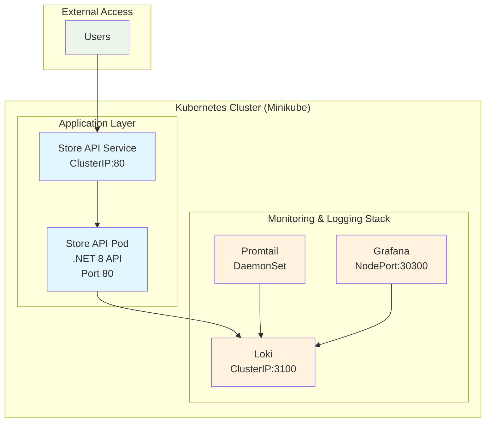
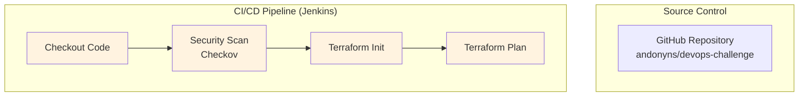

# DevOps Challenge - Infrastructure Architecture

## Overview

This document describes the updated infrastructure architecture and CI/CD pipeline for the DevOps Challenge application. The solution demonstrates a complete containerized microservices deployment with monitoring, logging, and automated infrastructure provisioning.

## Application Architecture

## Infrastructure Components

### Core Application
- **Store API**: .NET 8 REST API with CRUD operations
- **Docker Registry**: Local registry for container images
- **Kubernetes Service**: ClusterIP service exposing the API internally

### Monitoring & Logging
- **Grafana**: Visualization and dashboards (accessible via NodePort 30300)
- **Loki**: Log aggregation and storage (community Helm chart)
- **Promtail**: Log collection from all pods (community Helm chart)

### Container Orchestration
- **Minikube**: Local Kubernetes cluster
- **Helm Charts**: Community charts for Promtail, Loki, and Grafana
- **Docker**: Container runtime and image building

## CI/CD Pipeline

## Monitoring & Observability

### Logging Stack
- **Promtail**: Collects logs from all pods
- **Loki**: Aggregates and stores logs
- **Grafana**: Visualizes logs and metrics

### Health Checks
- **Liveness Probes**: `/health` endpoint monitoring
- **Readiness Probes**: `/ready` endpoint monitoring
- **Resource Limits**: CPU and memory constraints

## Continuous Integration Workflow

1. **Code Commit**: Developer pushes to GitHub
2. **Jenkins Trigger**: Pipeline starts manually
3. **Security Scan**: Checkov validates Terraform configurations
4. **Infrastructure Planning**: Terraform plan shows changes

## Deployment Workflow

**Infrastructure Deployment**:
   - Start Minikube cluster
   - Enable required addons (registry, ingress)
   - Build and push Docker images to local registry
   - Deploy application via Helm
   - Deploy monitoring stack

## Access URLs

### Development Environment
- **API**: `http://localhost:{forwarded_port}/items`
- **Grafana**: `http://localhost:30300` (admin/admin)
- **Minikube Dashboard**: `minikube dashboard`

### API Endpoints
- `GET /items` - List all items
- `POST /items` - Create new item
- `GET /items/{id}` - Get specific item
- `PUT /items/{id}` - Update item
- `DELETE /items/{id}` - Delete item
- `GET /health` - Health check
- `GET /ready` - Readiness check

To test the API, you can use the HTTP VSCode Extension changing the port
